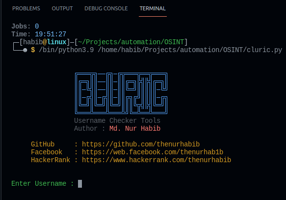

# Cluric

### A python tool made for check Username from over 100 Popular websites.

## Usage
`apt-get update`  
`apt-get upgrade`  
`pkg install git`  
`pkg install python3`  
`git clone https://github.com/thenurhabib/cluric`  
`pip install requests`  
`cd cluric`  
`.python3 cluric.py` 

## Screenshot

## 🔗 Links

## 🚀 About Me
I'm a programmer and Linux System Administrator.

## Author

- [@Md. Nur habib](https://www.github.com/thenurhabib)

